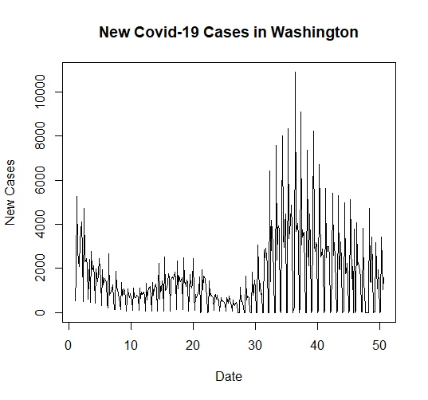
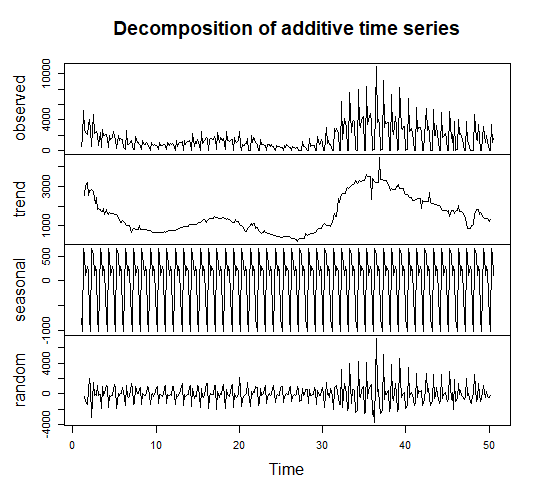
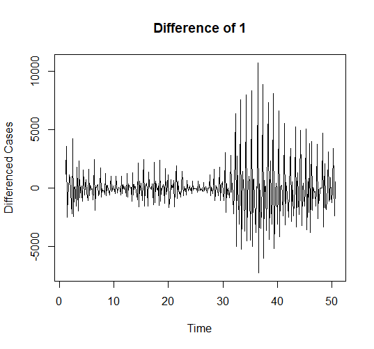
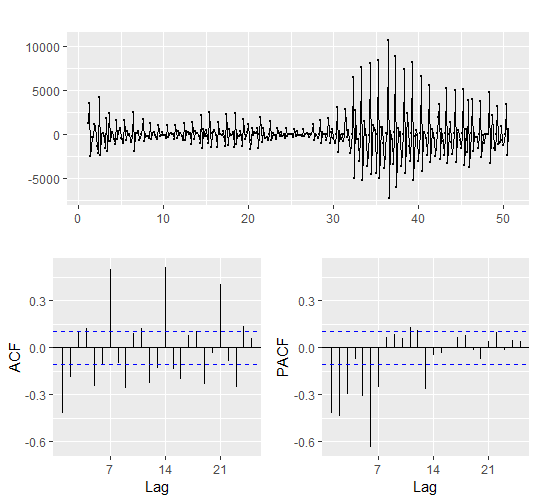
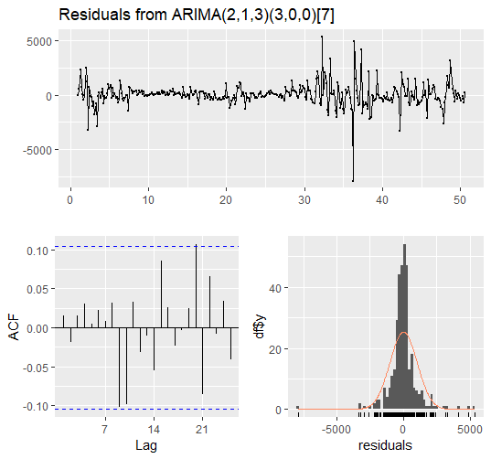
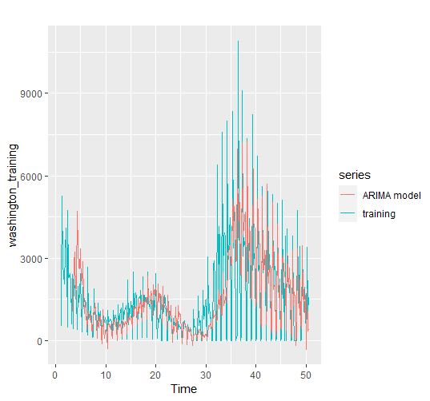
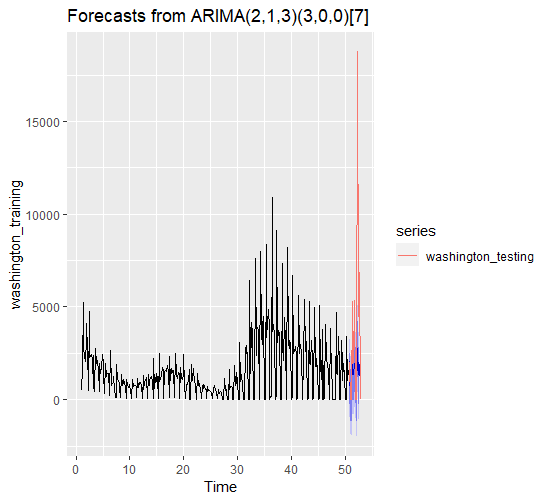

```{r setup, include=FALSE}
knitr::opts_chunk$set(echo = TRUE)
```

## Introduction: Project Overview and Data

This project aims to predict new COVID-19 cases in Washington state using time series analysis and forecasting. The data set is from <https://covidactnow.org/>. The data set used in this project is organized and tracks several factors daily, such as new cases, hospitalizations, deaths, etc. The only variables used in this project were "date" and "actuals.newCases." Only data from January 1st 2021 to December 31st 2021 were used in this project. The last 15 days were used as testing data, while the rest was training data.

## Components

Below is the line plot for new Covid-19 cases in Washington in 2021

```{r, echo=FALSE}

```

Its clear that there will be seasonality and some sort of irregular trend. To further analyze the components, we will visualize each component by decomposing the data

```{r, echo=FALSE}

```

It's now clear that there is a seasonality that appears to have a seasonal factor of 1 week or 7 days. There is also an irregular trend, which may cause more difficulties in building an accurate model.

## Creating the Model

Based on our analysis of the components, it appears that a SARIMA model is appropriate, because there is seasonality. There is a trend, so we need to difference it to eliminate it.

```{r, echo=FALSE}

```

The mean is now constant throughout, but there is volatility in the data. According to the Augmented Dickey-Fuller Test, the null hypothesis that the data is non-stationary is rejected.

```         
Augmented Dickey-Fuller Test

data: washington_diff Dickey-Fuller = -14.564, Lag order = 7, p-value = 0.01 alternative hypothesis: stationary
```

To determine the parameters for the SARIMA model, we need to analyze the ACF and PACF plot

```{r, echo=FALSE}

```

The first two lags appear to be significant on the ACF plot, indicating an MA(2) model.There is also significant spike at 7, 14, and 21, which corresponds to the seasonal component and a seasonal MA(3) model. On the PACF, lags 1, 2, 3, 5, 6, 7, and 13 are significant, but we will start of with an AR(3) model first. This leaves us with an ARIMA(2, 1, 3)(3, 0, 0)7 to start.

We will now build our first ARIMA model, then evaluate the residuals by applying the Ljung-Box test

```         
Ljung-Box test

data:  Residuals from ARIMA(2,1,3)(3,0,0)[7]
Q* = 10.448, df = 6, p-value = 0.107

Model df: 8.   Total lags used: 14
```

```{r, echo=FALSE}

```

According to the Ljung-Box test, the residuals are not correlated to each other. It is roughly normally distributed, but there is a massive spike at the center, which may indicate a pattern that our model is missing.

We will compare our model to our training data

```{r, echo=FALSE}

```

It appears that the model captures the seasonality and the trend well, but it lags behind in time. Additionally, the spikes in the model aren't as high as in the training data.

Now, we will forecast new cases for the next 15 days and compare it to the testing data

```{r, echo=FALSE}

```

It appears that the testing data has a massive spike that our model couldn't predict, but the spike seems unpredictable. Our model was able to accurately capture the seasonality that is present in the testing data. Overall, our model captures the main pattern and behaviour of our data, but falters when predicting the trend.
